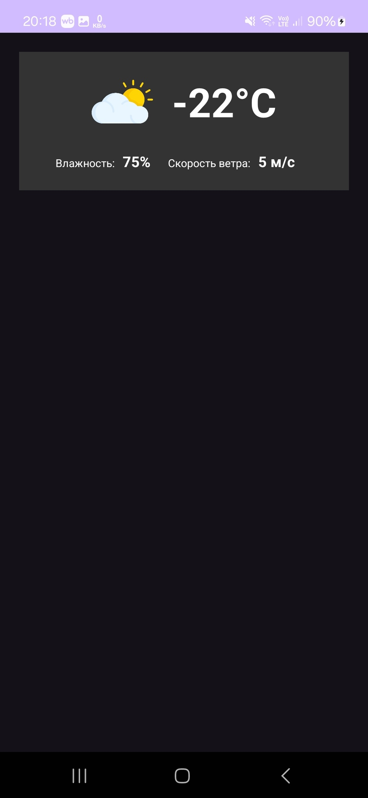
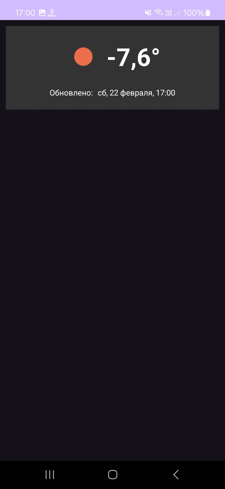
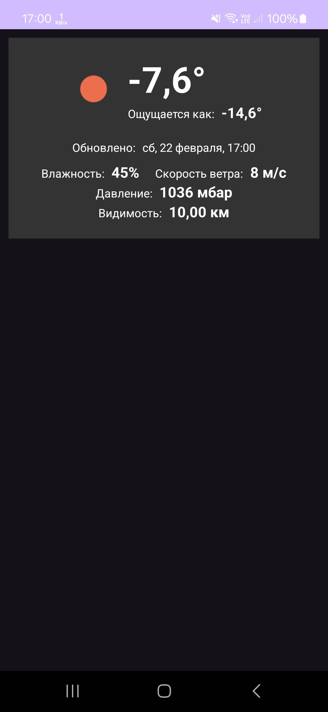
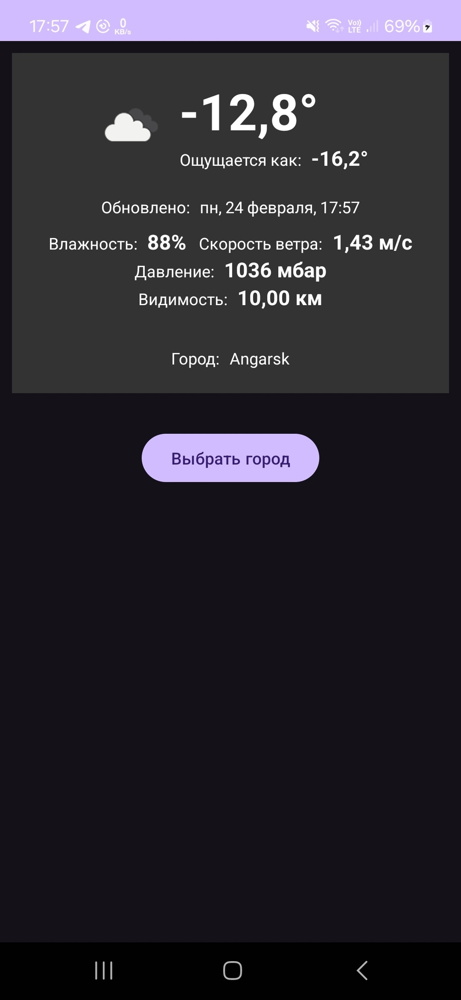
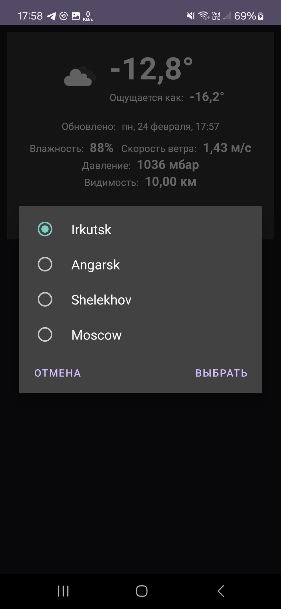
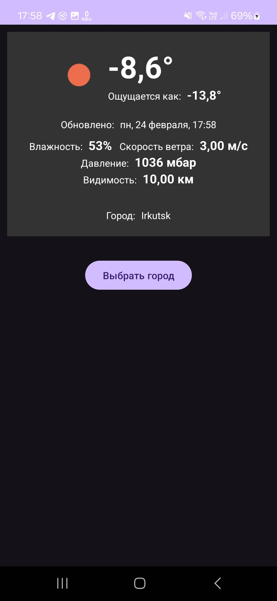

# Приложение погоды

## Задание "Работа с фрагментами"

<table>
    <tr>
        <td></td>
        <td></td>
    </tr>
</table>

## Задание "Обображение погоды с использованием фрагментов"

<table>
    <tr>
        <td></td>
        <td></td>
        <td></td>
    </tr>
</table>

## Задание "Переключение фрагментов в AlertDialog"

<table>
    <tr>
        <td></td>
        <td></td>
        <td></td>
    </tr>
</table>